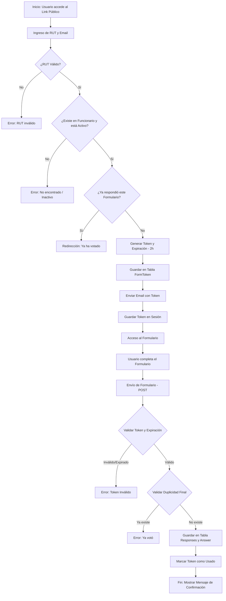

# Documentación del Flujo de Formularios - SIFOR

Este documento describe detalladamente el flujo completo desde la creación de un formulario hasta el envío de respuestas, pasando por la validación de identidad y la gestión de tokens de acceso.

## 1. Creación y Configuración del Formulario

En el módulo de administración o edición de formularios, el creador puede configurar diversos parámetros que rigen el comportamiento del mismo:

- **Fechas de Disponibilidad**: Se definen `start_date` (fecha de inicio) y `end_date` (fecha de cierre) mediante un input de tipo `datetime-local`. Estas fechas determinan cuándo el formulario está habilitado para recibir respuestas.
- **Recopilación de Datos**: Se pueden activar opciones para obligar la recolección de:
    - **RUT**: (`collect_rut`)
    - **Correo Electrónico**: (`collect_email`)
    - **Token de Acceso**: (`collect_token`)
- **Publicación**: El campo `is_public` determina si el formulario es accesible mediante el enlace público de validación de identidad.

## 2. Flujo de Validación de Identidad

Cuando un usuario accede al enlace de validación (`validate_form_identity`), el sistema sigue estos pasos:

1.  **Captura de Datos**: El usuario ingresa su **RUT** y **Correo Electrónico**.
2.  **Validaciones de Formato**:
    - Se verifica que ambos campos no estén vacíos.
    - Se valida el formato del RUT (incluyendo dígito verificador).
3.  **Validación de Funcionario**:
    - El sistema busca en la tabla `Funcionario` un registro que coincida con el RUT ingresado.
    - **Validación 1**: Si el funcionario no existe, se muestra un error: "Funcionario no encontrado".
    - **Validación 2**: Si el funcionario existe pero no está activo (`activo=False`), se muestra un error: "El funcionario no se encuentra activo".
4.  **Actualización de Información**: Si el funcionario es válido, se actualiza su campo `correo` con el email proporcionado.
5.  **Validación de Duplicidad**: Se verifica en la tabla `Responses` si ya existe una respuesta de este funcionario para el formulario actual. Si ya votó, se redirige a una página de "Ya votó".

## 3. Generación y Envío del Token de Acceso

Una vez superadas las validaciones de identidad, ocurre el proceso interno de autenticación:

1.  **Generación del Token**:
    - Se genera una cadena aleatoria segura usando `secrets.token_hex(32)`.
    - Se define una fecha de expiración (actualmente configurada a **2 horas** a partir de la creación).
2.  **Registro en Base de Datos**:
    - Se crea un registro en la tabla `FormToken` que vincula al `Form`, al `Funcionario` y almacena el `token`, su copia (`tokencopy`) y la `expiration_date`.
3.  **Envío por Correo**:
    - Se envía un correo electrónico al funcionario con el token generado.
    - Se utiliza la plantilla `index/emails/token_email.html`.
4.  **Persistencia en Sesión**: El token se guarda en la sesión del navegador (`request.session[f'form_token_{code}']`) para facilitar el acceso inmediato al formulario.

## 4. Visualización y Envío del Formulario

Al cargar el formulario (`view_form`) o intentar enviarlo (`submit_form`), el sistema realiza validaciones críticas:

1.  **Validación de Sesión/Token**:
    - Se intenta recuperar el token de la sesión.
    - Si el formulario requiere autenticación y no hay token, se bloquea el acceso.
2.  **Validaciones de Estado del Token**:
    - **Uso**: Si el token ya fue marcado como `used=True`, no se permite el envío.
    - **Expiración**: Se comprueba que `expiration_date` sea mayor a la hora actual.
3.  **Validación de Envío (POST)**:
    - Se limpian y validan las respuestas de cada pregunta.
    - Si el formulario tiene `collect_token=True`, se verifica que el token enviado en el POST coincida con el token de la sesión/base de datos.
    - Se verifica nuevamente que el funcionario no haya respondido previamente (prevención de envíos simultáneos).

## 5. Procesamiento Final

Tras el envío exitoso:
1.  Se crea el registro en la tabla `Responses`.
2.  Se vinculan las respuestas individuales en la tabla `Answer`.
3.  El token en la tabla `FormToken` se marca como **usado** (`used=True`).
4.  Se envía un correo de confirmación de recepción al usuario.

---

## Diagrama de Flujo

